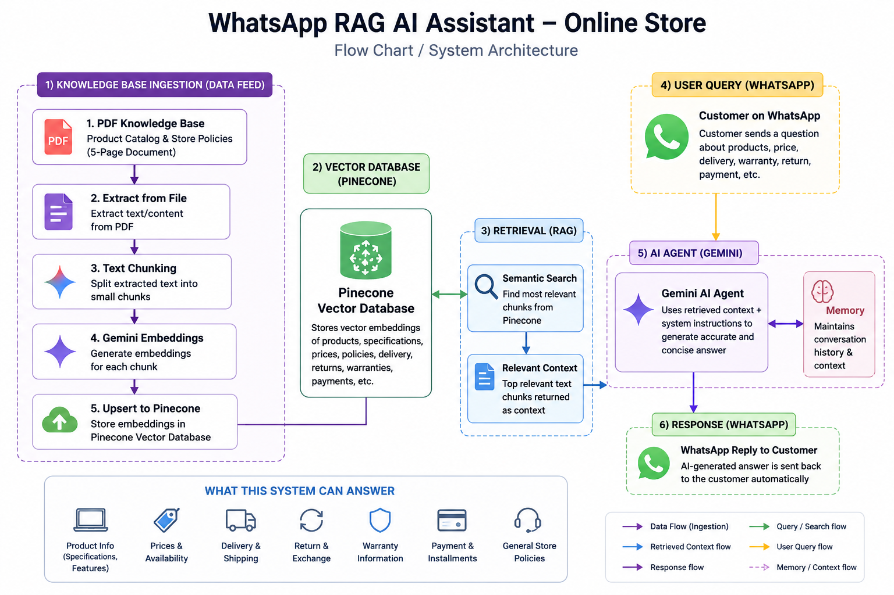

# 🤖 WhatsApp RAG AI Assistant – Online Store

An AI-powered **WhatsApp customer support assistant** built with **n8n, Google Gemini, and Pinecone RAG**.

The system allows customers to ask questions about an online store's products, prices, specifications, delivery, returns, warranties, payment methods, and installment plans directly through WhatsApp.

Instead of relying only on the LLM's general knowledge, the assistant retrieves relevant information from the store's knowledge base using **Retrieval-Augmented Generation (RAG)** before generating a response.

---

## 🚀 Project Overview

This workflow demonstrates how **AI + RAG + WhatsApp automation** can be used to build an intelligent customer-support system for an e-commerce business.

The store's product catalog and business policies are provided as a document. The workflow extracts the document content, creates embeddings using **Google Gemini**, and stores them in **Pinecone Vector Database**.

When a customer sends a WhatsApp message, the AI Agent searches the knowledge base for relevant information and generates a concise response based on the retrieved content.

---

## ✨ Key Features

* 💬 WhatsApp-based AI customer support
* 🔎 Retrieval-Augmented Generation (RAG)
* 🧠 Google Gemini AI
* 🗄️ Pinecone Vector Database
* 📄 PDF knowledge-base ingestion
* 🔤 Gemini embeddings for semantic search
* 💰 Product prices and specifications
* 🚚 Delivery & shipping information
* 🔄 Return & exchange policies
* 🛡️ Warranty information
* 💳 Payment methods & installment plans
* 🧠 Conversation memory
* 🚫 Context-based responses to reduce hallucinations
* ⚡ Automated WhatsApp responses

---

## 📸 Workflow chart



## 🔄 How It Works

### 1. Knowledge Base Ingestion

A store catalog and policy document is uploaded through an n8n form.

The workflow extracts the PDF content and prepares it for vector storage.

### 2. Embedding Generation

The extracted content is converted into embeddings using **Google Gemini Embeddings**.

### 3. Vector Storage

The embeddings are stored in a **Pinecone Vector Database**, allowing the system to perform semantic similarity searches.

### 4. Customer Query

A customer sends a question through WhatsApp, such as:

> "What is the price of iPhone 15 256GB?"

or:

> "Do you offer installment plans?"

### 5. RAG Retrieval

The AI Agent searches the Pinecone knowledge base and retrieves the most relevant information.

### 6. AI Response

Google Gemini uses the retrieved context to generate a short and professional response.

### 7. WhatsApp Reply

The generated response is automatically sent back to the customer through WhatsApp.

---

## 🧰 Tech Stack

| Technology        | Purpose                |
| ----------------- | ---------------------- |
| **n8n**           | Workflow automation    |
| **Google Gemini** | LLM & embeddings       |
| **Pinecone**      | Vector database        |
| **WhatsApp**      | Customer communication |
| **RAG**           | Knowledge retrieval    |
| **JavaScript**    | Data processing        |
| **PDF**           | Knowledge-base source  |

---

## 🛡️ AI Response Control

The AI Agent is configured to answer questions **only from the retrieved store knowledge base**.

If the requested information is not available, the assistant is instructed not to guess or invent an answer.

This approach helps create more reliable responses for product and policy-related customer support.

---

## 💡 Example Use Cases

### Product Search

**Customer:**

> "Show me laptops under PKR 120,000."

**AI Assistant:**
Returns matching laptops from the store knowledge base with available specifications and prices.

### Product Information

**Customer:**

> "What are the specifications of the Samsung Galaxy A55?"

The assistant retrieves the relevant product information from the vector database.

### Store Policies

**Customer:**

> "What is your return policy?"

The assistant retrieves the applicable return and exchange policy.

### Delivery

**Customer:**

> "How long does delivery take to Islamabad?"

The assistant provides the delivery information available in the knowledge base.

### Payment

**Customer:**

> "Do you offer installment plans?"

The assistant provides the available installment information.

---

## 🎯 Skills Demonstrated

* AI Automation
* n8n Workflow Development
* Retrieval-Augmented Generation (RAG)
* Vector Database Integration
* Prompt Engineering
* LLM Integration
* WhatsApp Automation
* Document Processing
* Semantic Search
* AI Customer Support
* Workflow Architecture
* API Integration

---

## 📌 Portfolio Implementation

This project demonstrates a practical implementation of an **AI-powered e-commerce customer support system** where customers can interact with a business through WhatsApp and receive knowledge-grounded answers automatically.

A sanitized n8n workflow file is included for portfolio demonstration.

👉 [View / Download Workflow JSON](WhatsApp_RAG_AI_Assistant.json)

For custom implementation or commercial use, please <strong>Contact Us:</strong>
<a href="https://wa.me/923002120566">

</a>
<a href="https://www.linkedin.com/in/faheem-abbas-ai-automation-specialist/">

</a>

## 👨‍💻 Author

**Faheem Abbas**

AI Automation Specialist | n8n Expert | AI Agents | AI-Powered Business Automation | Lead Generation | API Integrations

**#AI #AIAutomation #n8n #RAG #GoogleGemini #Pinecone #WhatsAppAutomation #LLM #AIEngineering #Automation #bluemoonways**

```
```
